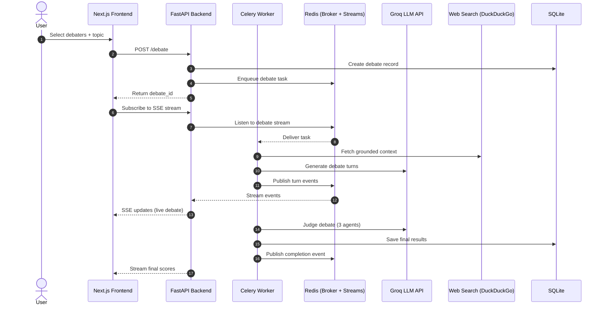

# Debate Arena Backend

This is FastAPI backend powering the Debate Arena, which orchestrates multi-agent debates, streaming events, caching, persistence, and scoring.

This backend handles:

- Multi-agent debate orchestration
- Mandatory live web grounding (DuckDuckGo via CrewAI tools)
- Sequential turn-based debate rounds
- Structured 3-judge panel scoring
- Real-time streaming via Server-Sent Events (SSE)
- Async execution using Celery
- Redis-backed caching, locks, and event streams
- SQLite-backed persistence for local development

## Quick Start

This repository is designed so a new developer can:
1. Clone the repo
2. Go to backend folder
3. Create a `.env`
4. Fill the required API keys in .env.example
5. Run one command to start the backend

```bash
docker compose up --build
```

You can access:
- Swagger UI via `http://localhost:8000/docs`
- Health check using `http://localhost:8000/health`

This setup ensures new developers can clone, configure, and run immediately.

## Purpose and Scope
The backend is responsible for:

- Accepting debate creation requests
- Validating inputs and managing session/user context
- Enforcing concurrency locks and caching
- Orchestrating CrewAI multi-agent flows
- Streaming debate events in real-time
- Persisting final results and analytics

Debates are:

- Sequential turn-based
- Fixed number of rounds
- Time-limited
- Using the same model temperature per agent
- Grounded via mandatory DuckDuckGo search

## Architecture Overview

Docker Compose starts the following services:

| Service         | Purpose                               |
| --------------- | ------------------------------------- |
| `backend`       | FastAPI application                   |
| `celery-worker` | Executes debate tasks                 |
| `celery-beat`   | Scheduler (ready for periodic tasks)  |
| `redis`         | Broker, cache, locks, event transport |
| `frontend`      | Next.js UI on port `3000`             |



***High-Level Flow***

1. Client sends POST /debate
2. FastAPI validates request, checks cache/locks in `redis`, writes DB record, queues Celery task
3. Celery worker runs CrewAI debate flow
4. Agents perform web-grounded reasoning
5. Events are published to Redis streams
4. Client consumes `GET /debate/{debate_id}/events` (SSE) from `redis`
5. Final metrics/status persist in SQLite


## Tech Stack
- Python 3.11
- FastAPI
- CrewAI
- LangChain Community
- Celery
- Redis 7
- SQLAlchemy
- Docker + Docker Compose
- `uv` for dependency and runtime execution inside containers

## Prerequisites

- Docker Desktop (or Docker Engine + Compose plugin)
- Git

Verify:

```bash
docker --version
docker compose version
```

## Environment Variables

Core container/runtime variables that can be copied from `.env.example`:

| Variable | Default | Purpose |
|---|---|---|
| `REDIS_HOSTNAME` | `redis` | Redis host for cache, locks, broker/backend, and event transport |
| `REDIS_PORT` | `6379` | Redis port |
| `CELERY_BROKER_URL` | `redis://redis:6379/0` | Celery broker |
| `CELERY_RESULT_BACKEND` | `redis://redis:6379/0` | Celery result backend |
| `SQLITE_DATABASE_PATH` | `/app/data/debate.db` | SQLite file path in container |
| `OPENAI_API_KEY` / `GROQ_API_KEY` | unset | Provider API key(s) |

App tuning variables are listed in `.env.example` (cache TTL, retries, stream timeouts, model names, delays, pricing map). 
⚠️Ensure never to commit real API keys

## API Endpoints

Main endpoints:
- `GET /health`
- `GET /redis-test`
- `POST /debate`
- `GET /debate/{debate_id}/events?session_id=...&user_id=...`
- `GET /debates?session_id=...&user_id=...`
- `GET /debates/analytics?session_id=...&user_id=...`
- `GET /debates/overview?session_id=...&user_id=...`

Example create debate:

```bash
curl -X POST "http://localhost:8000/debate" \
  -H "Content-Type: application/json" \
  -d '{
    "topic": "Is remote work better for innovation?",
    "debater_1": "elon_musk",
    "debater_2": "greta",
    "session_id": "session-123",
    "user_id": "user-123"
  }'
```

Example stream events (SSE):

```bash
curl -N "http://localhost:8000/debate/<debate_id>/events?session_id=session-123&user_id=user-123"
```

## Project Structure

```text
app/
  main.py
  routers/
  debate_orchestration.py
  tasks/
  celery_app.py
  db/
  core/config.py

src/
  flow.py
  events.py

docker-compose.yml
Dockerfile
docker/entrypoint.sh
```

## Operational Commands
### View Logs
```bash
docker compose logs -f backend celery-worker celery-beat redis
```

### Shell Into Backend
```bash
docker compose exec backend bash
```

### Restart Backend
```bash
docker compose restart backend
```

### Restart Backend
```bash
docker compose down -v
docker compose up --build
```

## Persistence
Named volumes:
- `sqlite_data → /app/data`
- `redis_data → /data`

Data survives restarts unless volumes are removed.

## Troubleshooting

Common issues:

1. Docker daemon not running
- Symptom: errors about Docker engine/pipe not found
- Fix: start Docker Desktop and retry

2. Port already in use
- Symptom: `bind: address already in use` on `8000`
- Fix: free port or map another host port in `docker-compose.yml`

3. Missing env vars or bad API key
- Symptom: debate tasks fail during model calls
- Fix: verify `.env` values and restart stack

4. Want fresh local state
- Run:
```bash
docker compose down -v
docker compose up --build
```


## Security Consideration
- Do not commit .env
- Rotate exposed keys immediately
- Restrict CORS in production
- Move secrets to managed secret store for production

## Disclaimer
This backend powers AI-generated debates using simulated personas.

Outputs are AI-generated and may:
- Contain inaccuracies
- Reflect biases
- Misrepresent real individuals

The system is intended for educational and demonstration purposes only.
It is not affiliated with or endorsed by any real individual referenced by debate personas.


